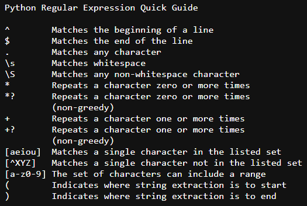

# python-fe
### Python for Everybody - freeCodeCamp.org
- https://youtu.be/8DvywoWv6fI

#### Python Notes
- Lists are mutable 
Strings are "immutable" - you cannot change the contents of a string - you must make a new string to make any change 
List are "mutable" - you can change an element of a list using the index operator 

    List - A linear collection of values that stay in order 
    Key - Value 
    [0] = 21 
- Dictionary - A "bag" of values, each with its own label 
    Key - Value 
    {"candy": 3}  
    The get() method is commonly used in dictionaries to see if a Key exists - see 'count_file.py' 
- Tuples are immutable 
    Unlike a List, once you create a Tuple, you cannot alter its contents - similar to a string. 
    Used for temporary variables, don't require to be modified, so they are simpler and more efficient in terms of memory use and preformance than Lists 
- Regular Expressions 

#### Links
- https://docs.python.org/3/library/stdtypes.html#string-methods
- http://www.py4inf.com/code/mbox-short.txt
- https://en.wikipedia.org/wiki/Algorithm
- https://en.wikipedia.org/wiki/Data_structure
- https://docs.python.org/3/tutorial/datastructures.html
- https://www.py4e.com/book.php
- https://github.com/csev/py4e
- https://en.wikipedia.org/wiki/Associative_array
- https://wiki.python.org/moin/HowTo/Sorting
- https://en.wikipedia.org/wiki/Regular_expression
- https://xkcd.com/208/
